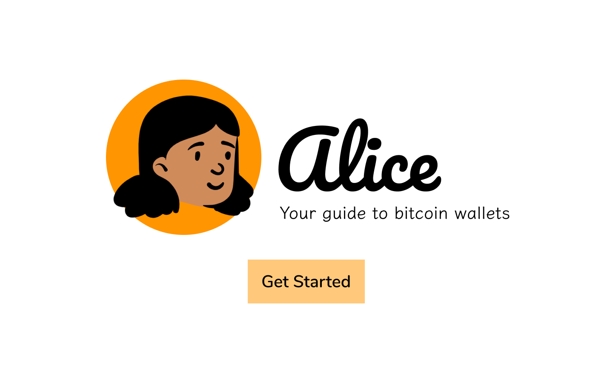

# Alice



Alice is your guide to bitcoin wallets. She's a cool person to know.

For [PlebFi Austin Hackathon](https://pleb.fi/austin/)

Keep Austin pleb.

[See Figma File](https://www.figma.com/file/Ba2hYmkPj7gS4Ej1k71hjv/Bitcoin-Wallet-Guide?node-id=0%3A1) (which is a work-in-progress, obviously)

## Goal

Create helpful tool to onboard people to bitcoin payments, either through their own exploration or through the guidance of an app.

## Project setup
```
npm install
```

### Compiles and hot-reloads for development
```
npm run serve
```

### Compiles and minifies for production
```
npm run build
```

### Lints and fixes files
```
npm run lint
```

### Customize configuration
See [Configuration Reference](https://cli.vuejs.org/config/).
